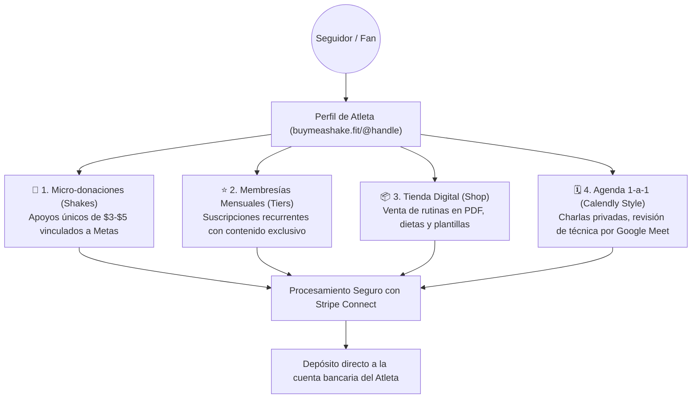

#  Buymeashake.fit — Documentación Integral del Concepto & Plataforma

> **"Financia tu esfuerzo. Recibe el apoyo de tus fans."**  
> *Plataforma de micro-mecenazgo y monetización deportiva directa para atletas, coaches y creadores fitness.*

---

##  1. Resumen Ejecutivo & Visión

**Buymeashake.fit** es la primera plataforma de monetización directa diseñada **específicamente para el ecosistema deportivo y fitness**. Inspirada en la simplicidad, rapidez y empatía de modelos como *Buy Me a Coffee*, sustituye el concepto tradicional del café por un **Shaker de proteína deportivo (🥤)**, alineando el lenguaje, la estética visual (*Dark Athletic / Action Green*) y las herramientas comerciales a la realidad de los deportistas.

Permite a cualquier atleta, competidor, preparador físico o creador de contenido centralizar sus fuentes de ingresos en un único enlace personalizado (`buymeashake.fit/@tu_nombre`), eliminando la fricción de cobranzas manuales por transferencias bancarias o el uso de múltiples plataformas dispersas.

---

##  2. La Propuesta de Valor

### Para los Atletas y Coaches
* **Monetización Integral en un solo lugar:** No necesitan Patreon para membresías, Gumroad para PDFs, Calendly para citas y PayPal para propinas. Todo convive en su perfil público.
* **Cero cuotas mensuales fijas:** El registro y uso de la plataforma es 100% gratuito. La plataforma solo cobra una pequeña comisión por transacción procesada con éxito.
* **Empatía y Sentido de Pertenencia:** Los seguidores no "donan por caridad"; financian un objetivo tangible (ej. viajes a torneos, suplementación, equipamiento) mediante **Metas Deportivas Dinámicas**.

### Para los Seguidores y la Comunidad
* **Micro-apoyos sin fricción:** Posibilidad de invitar un Shake de $3 o $5 USD en 2 clics con tarjeta o monederos digitales (Google Pay / Apple Pay) sin necesidad de registrarse obligatoriamente.
* **Recompensas Reales:** Acceso a rutinas descargables, planes nutricionales, sesiones 1-a-1 de revisión de técnica y publicaciones exclusivas de entrenamientos.
* **Transparencia Total:** Visualización del impacto directo de su aporte en el progreso de la meta deportiva del atleta.

---

##  3. Los 4 Pilares de Monetización



### 1.  Micro-donaciones de Shakes (One-time Support)
* Los fans invitan 1, 3, 5 o una cantidad personalizada de Shakes ($3, $5 o $10 USD configurables por el atleta).
* Los seguidores pueden adjuntar mensajes de aliento públicos o privados.
* Cada shake recibido avanza en tiempo real la barra de progreso de la **Meta Activa** del atleta (ej. *"Comprar Rack de sentadillas — $1,200 USD"*).

### 2. Membresías Mensuales por Niveles (Tiers)
* El atleta configura niveles de suscripción (ej. *Nivel Atleta $5/mes*, *Nivel Pro $15/mes*, *Atleta Elite $35/mes*).
* Desbloqueo automático de publicaciones bloqueadas, acceso a canales privados (Discord/WhatsApp) y llamadas grupales.

### 3.  Tienda Fitness Digital (Digital Products)
* Venta instantánea de guías en PDF (rutinas de hipertrofia, periodización, planes de nutrición) y plantillas descargables.
* El seguidor paga y obtiene la descarga inmediata con enlace seguro en la pantalla post-pago y por correo electrónico.

### 4.  Agenda de Asesorías 1-a-1 (Estilo Calendly)
* El atleta define servicios (ej. *Revisión de Técnica de Levantamiento — 45 min — $40 USD*), su disponibilidad semanal y franjas horarias.
* El cliente selecciona fecha, hora, realiza el pago y ambos reciben la confirmación con el enlace directo a la sala de **Google Meet**.

---

##  4. Identidad Visual: *Action-Performance Athleticism*

La plataforma implementa un sistema visual moderno diseñado para transmitir energía de alto rendimiento:

| Elemento | Especificación | Propósito |
|---|---|---|
| **Tipografía de Título** | `Montserrat` (Pesos 700, 800, 900 Black) | Titulares contundentes, enérgicos y de gran impacto visual. |
| **Tipografía de Lectura** | `Inter` (Pesos 400 a 800) | Lectura clara y óptima en tablas, métricas y artículos. |
| **Fondo Principal** | Dark Charcoal (`#090C0A` / `#111415`) | Ambiente oscuro premium que resalta las fotografías de entrenamiento. |
| **Acento Primario** | Action Green (`#CCFF00` / `#C9FF3D`) | Verde lima eléctrico para botones de acción, barras de progreso y badges. |
| **Modo Claro / Oscuro** | Toggle instantáneo (`ThemeService`) | Permite alternar entre el modo oscuro atlético y el modo claro minimalista clásico. |
| **Iconografía** | Suite Standalone de SVG nativos | Cero emojis para una apariencia 100% profesional y limpia. |

---

##  5. Mapa de Vistas & Funcionalidades

### Vistas Públicas
1. **Landing Page (`/`):** Hero cinematográfico con atletas en vivo, bento grid de 3 pasos ("El camino al patrocinio") y llamadas a la acción.
2. **Explorador & Directorio (`/explore`):** Buscador de atletas con filtros por disciplina (*Fuerza, CrossFit, Running, Artes Marciales, etc.*) y podio del **Top 10 Mensual**.
3. **Perfil Público del Atleta (`/:username`):**
   * Portada con foto de acción y avatar con halo Action Green.
   * Biografía, tags de especialidad y barra interactiva de Meta Deportiva.
   * Widget de 5 pestañas: **Shakes**, **Membresías**, **Tienda**, **Agendar 1-a-1** y **Muro de Posts**.
4. **Pantalla Post-Pago Inteligente (`Thank You Screen`):** Reconoce dinámicamente si la compra fue un Shake (agradecimiento), un PDF (botón de descarga), una Cita (enlace de Google Meet) o una Membresía (desbloqueo de posts).

###  Panel de Control del Creador (`/dashboard/`)
1. **Inicio (`/home`):** Métricas de ingresos en vivo de los últimos 30 días, cantidad de shakes y desglose por tipo de monetización.
2. **Supporters (`/supporters`):** Listado cronológico de seguidores y mensajes recibidos.
3. **Membresías (`/memberships`):** CRUD de niveles, precios y beneficios.
4. **Tienda (`/shop`):** Gestor de productos digitales con subida de PDFs y configuración de videollamadas.
5. **Muro de Publicaciones (`/posts`):** Listado de posts y métricas de lectura/likes.
6. **Editor de Posts (`/posts/new`):** Rich text editor con toolbar de formato, subida de imágenes y selector de visibilidad (*Público vs Solo Miembros con Nivel requerido*).
7. **Ajustes & Metas (`/settings`):** Configuración de precio de shake, moneda (`USD` / `MXN`), avatar, portada y activación de meta deportiva.
8. **Retiros & Payouts (`/payouts`):** Conexión con Stripe Connect Express para transferencias bancarias automáticas.

---

##  6. Arquitectura Técnica

```mermaid
graph LR
    subgraph Frontend "Angular 19 (Standalone & Signals)"
        UI[Componentes OnPush + Signals]
        Themes[ThemeService Dark/Light]
        Interceptors[Auth Interceptor Bearer JWT]
    end

    subgraph Backend "FastAPI (Clean Architecture)"
        Routers[API v1 Routers]
        Services[Core Business Services]
        Repos[SQLAlchemy ORM Repositories]
        Static[Static Storage /uploads]
    end

    subgraph Database "MySQL Database"
        DB[(Tablas: Users, Athletes, Goals, Posts, Tiers, Products, Bookings, Transactions)]
    end

    UI -->|HTTP / JSON| Routers
    Routers --> Services
    Services --> Repos
    Repos --> DB
```

* **Frontend:** Angular 19 Standalone, Signals reactivos (`signal`, `computed`), Control Flow (`@if`, `@for`), Tailwind CSS v4, `ChangeDetectionStrategy.OnPush`.
* **Backend:** FastAPI (Python 3.12+), Thin Controllers, Dependency Injection (`CurrentUser`, `CurrentAthlete`), Pydantic v2 DTOs, SQLAlchemy ORM.
* **Base de Datos:** MySQL con soporte UTF8MB4 y esquemas relacionales normalizados.
* **Pagos & Almacenamiento:** Integración con Stripe Connect para cobros y payouts; almacenamiento local estructurado para imágenes y guías digitales servido en `/static`.
